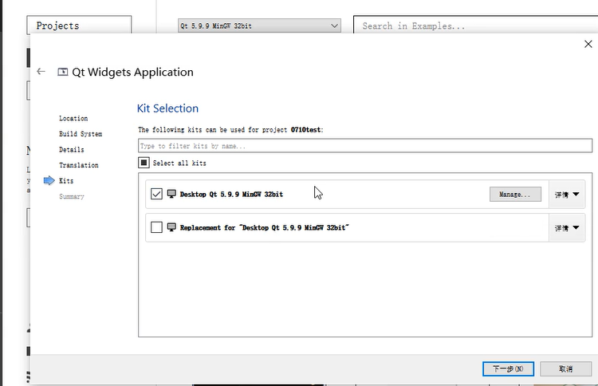
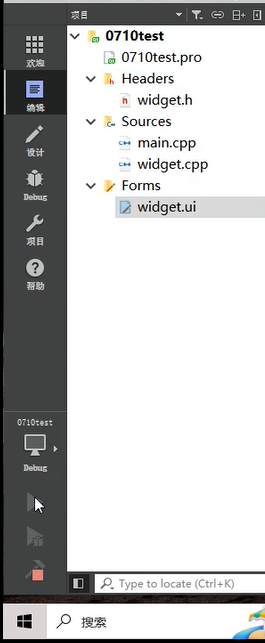
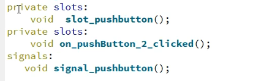

# 08/01

## 07/10





出来一个弹出窗口就成功了


**QT自带垃圾回收** QT对象树 父窗口销毁的时候会自动销毁

自己定义的用双引号

**自己加资源文件**

也可以在ui界面拖拽实现

需要先构建之后才能把拖拽的功能跑出来

****

将结果显示到指定控件

- 要将字符串转成数字才能相加10
- 显示到控件上 关键函数`setText`


信号和槽

- 信号发送方：按钮
- 信号触发事件：被点击
- 信号接收方：窗口
- 槽函数：信号与槽的对应关系是多对多

事件

- 有事件产生信号

****

槽函数

- 可以自己定义在头文件里（*alt键+回车可以快捷定义·*）

- ```
  private slots:
      void on_pushButton_clicked();
      
      
  connect(ui->pushButton,
              &QPushButton::clicked,
              this,
              &Widget::on_pushButton_clicked);
  
  
  ```

  之前几次尝试失败都是因为第四个参数没设置成`widget`

- 简单函数可以**匿名函数**实现

  ~~~c++
   connect(ui->pushButton, &QPushButton::clicked, this, [=](){
          int value1 = ui->lineEdit1->text().toInt();
          int value2 = ui->lineEdit2->text().toInt();
          ui->lineEdit3->setText(QString::number(value1 + value2));
      });
  
  ~~~

  - 发送信号

    ~~~
     emit ui->pushButton_2->clicked();
    ~~~

    自己定义信号的时候无需`private`或者是`public`，只声明就可以了，槽函数是需要实现的



- 槽和信号的参数尽量保持一致，否则槽的参数数量小于信号

***

设置背景

```
 setStyleSheet("background-image: url(:/Image/0.png);");
```