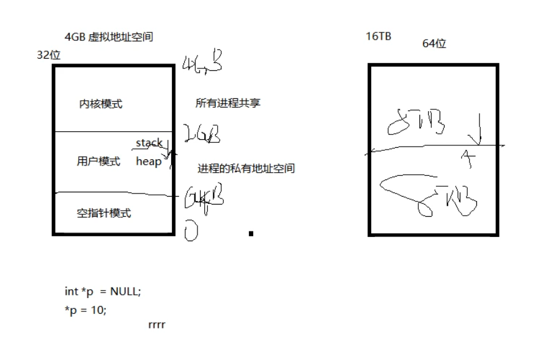

# 08/05

## 创建进程

~~~c++
#include "widget.h"
#include <windows.h>
#include "QDebug"
#include <QApplication>

int main(int argc, char *argv[])
{
    QApplication a(argc, argv);
    Widget w;
    w.show();


    STARTUPINFOA si={sizeof(STARTUPINFOA)};
    PROCESS_INFORMATION pi;
    char szbuf[1024]="D:\\software\\WeChat\\WeChat.exe";

    CreateProcessA(0,
                  szbuf,
                  0,
                  0,
                  0,
                  NORMAL_PRIORITY_CLASS,
                  0,
                  0,
                  &si,
                  &pi
                  );

    qDebug()<<GetLastError();
    return a.exec();


}

~~~

错误历史：

1. 路径没有加反斜杠
2. 错误代码返回5权限不够


## 进程与线程的概念

4GB虚拟地址空间 



对于同一个CPU的占用（并发）：轮换时间片在跑，线程是真正执行的（执行单元），线程只是占用资源（分配资源的基本单位）

对于不同CPU的占用（并行）：真正可以同时执行

## 进度条

```c++
void Widget::on_pushButton_clicked()
{
    for(int i=0;i<=100;i++){
        ui->progressBar->setValue(i);
        Sleep(100);
    }
}
 connect(ui->pushButton,
            &QPushButton::clicked,
            this,
            &Widget::on_pushButton_clicked);

```

*这样有一个问题就是跑的期间不能干别的*

解决办法：在槽函数里面创建线程，在线程函数里面实现——但是问题是空间都是在主线程里面不允许跨线程——在线程函数里面发送信号在槽函数里实现值的显示——在`Widget`类的定义里实现新信号与新槽的绑定