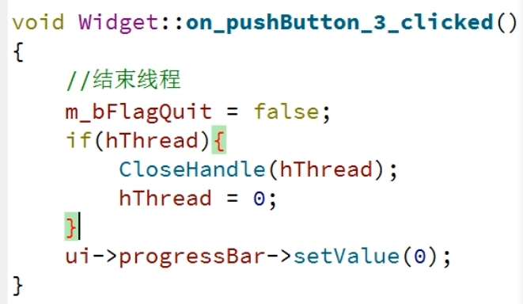
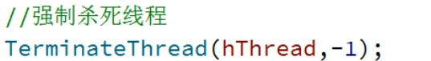
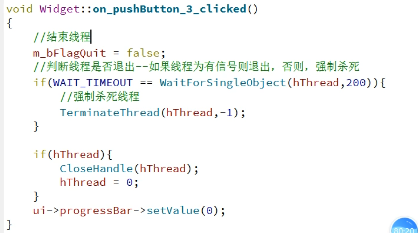
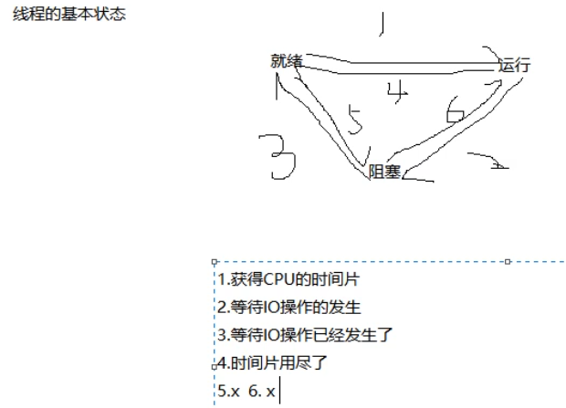

# 08/05

## 创建进程

~~~c++
#include "widget.h"
#include <windows.h>
#include "QDebug"
#include <QApplication>

int main(int argc, char *argv[])
{
    QApplication a(argc, argv);
    Widget w;
    w.show();


    STARTUPINFOA si={sizeof(STARTUPINFOA)};
    PROCESS_INFORMATION pi;
    char szbuf[1024]="D:\\software\\WeChat\\WeChat.exe";

    CreateProcessA(0,
                  szbuf,
                  0,
                  0,
                  0,
                  NORMAL_PRIORITY_CLASS,
                  0,
                  0,
                  &si,
                  &pi
                  );

    qDebug()<<GetLastError();
    return a.exec();


}

~~~

错误历史：

1. 路径没有加反斜杠
2. 错误代码返回5权限不够


## 进程与线程的概念

4GB虚拟地址空间 


对于同一个CPU的占用（并发）：轮换时间片在跑，线程是真正执行的（执行单元），线程只是占用资源（分配资源的基本单位）

对于不同CPU的占用（并行）：真正可以同时执行

## 进度条

```c++
void Widget::on_pushButton_clicked()
{
    for(int i=0;i<=100;i++){
        ui->progressBar->setValue(i);
        Sleep(100);
    }
}
 connect(ui->pushButton,
            &QPushButton::clicked,
            this,
            &Widget::on_pushButton_clicked);

```

*这样有一个问题就是跑的期间不能干别的*

解决办法：在槽函数里面创建线程，在线程函数里面实现——但是问题是空间都是在主线程里面不允许跨线程——在线程函数里面发送信号在槽函数里实现值的显示——在`Widget`类的定义里实现新信号与新槽的绑定

### 线程的挂起与恢复

```c++
void Widget::on_pushButton_clicked()
{

    if(!hThread){
       hThread= CreateThread(0,
                         0,
                         &ThreadProc,
                         this,
                         0,
                         0);
    }
    else
        ResumeThread(hThread);


}
void Widget::on_pushButton_2_clicked()
{
    SuspendThread(hThread);
}

```

**问题是为什么上午的那个需要连接这次不需要呢**不同进程的切换，暂停进程本质上是对新建进程的控制，进程处理函数不能放在类里面必须是公有的








**问题是`stop`之后再次点击`go`为啥没反应了**

因为在杀死进程后`flag`设置为`false`，再次创建的时候类的成员变量值没有改变

```c++
#include "widget.h"
#include "ui_widget.h"


Widget::Widget(QWidget *parent)
    : QWidget(parent)
    , ui(new Ui::Widget)
{
    hThread=0;
    ui->setupUi(this);

    connect(ui->pushButton,
            &QPushButton::clicked,
            this,
            &Widget::on_pushButton_clicked);

    connect(this,&Widget::sendI,this,&Widget::receiveI);


}

Widget::~Widget()
{
    delete ui;
}

DWORD WINAPI ThreadProc(_In_ LPVOID lpParameter)
{
    Widget *pThis=(Widget*)lpParameter;
    pThis->threadFlag=true;
    while(pThis->threadFlag){
        for(int i=0;i<=100;i++){

                emit pThis->sendI(i);
            Sleep(100);


            }
    }

}

void Widget::receiveI(int i)
{
    ui->progressBar->setValue(i);
}

void Widget::on_pushButton_clicked()
{

    if(!hThread){
       hThread= CreateThread(0,
                         0,
                         &ThreadProc,
                         this,
                         0,
                         0);
    }
    else
        ResumeThread(hThread);


}


void Widget::on_pushButton_2_clicked()
{
    SuspendThread(hThread);
}

void Widget::on_pushButton_3_clicked()
{
    threadFlag=false;
    if(WAIT_TIMEOUT==WaitForSingleObject(hThread,200))
        TerminateThread(hThread,-1);
    if(hThread){
        CloseHandle(hThread);
        hThread=0;
    }
    ui->progressBar->setValue(0);
}

```

## 线程的基本状态



## 多个进程共享同一个变量

### 技巧：

1. 引入`windows.h`的时候如果识别不了就在pro里面加入`QT=+core`

## 问题

1. 不知道为什么打印出来的线程id都是-2

   *在`printf`语句中，你使用了`GetCurrentThread()`函数来获取当前线程的句柄（handle），而`GetCurrentThread()`函数返回的是当前线程的伪句柄（pseudo-handle），而不是真实的线程ID*

2. 票剪完之后也必须立马打印

3. 为什么票数会出现负数

   在进入临界区之前两个线程的票数都为-1，一个离开另一个被阻塞的进入出现负数、

4. 线程离开的问题

## 解决

1. 原子访问

   只能锁定一个资源

2. 临界区（代码段）

   ~~~c++
   #include <QCoreApplication>
   #include <windows.h>
   #define MAX 10
   
   CRITICAL_SECTION cs;
   long ticket=100;
   
   DWORD WINAPI ThreadProc(_In_ LPVOID lpParameter){
       while(1){
           if(ticket<=0){
               printf("current thread[%d]is gone\n",GetCurrentThreadId());
               break;
           }
   
   
           EnterCriticalSection(&cs);
           if(ticket==0){
               printf("current thread[%d]is gone\n",GetCurrentThreadId());
               LeaveCriticalSection(&cs);
               break;
           }
   
           ticket--;
           printf("current thread[%d] ticket = %d\n",GetCurrentThreadId(),ticket);
           LeaveCriticalSection(&cs);
            Sleep(10);
       }
       return 0;
   
   }
   int main(int argc, char *argv[])
   {
       QCoreApplication a(argc, argv);
   
       InitializeCriticalSection(&cs);
   
       HANDLE hThread[MAX];
   
       for(int i=0;i < MAX ;i++){
            hThread[i]=CreateThread(0,0,&ThreadProc,0,0,0);
       }
   
       return a.exec();
   }
   
   ~~~

   