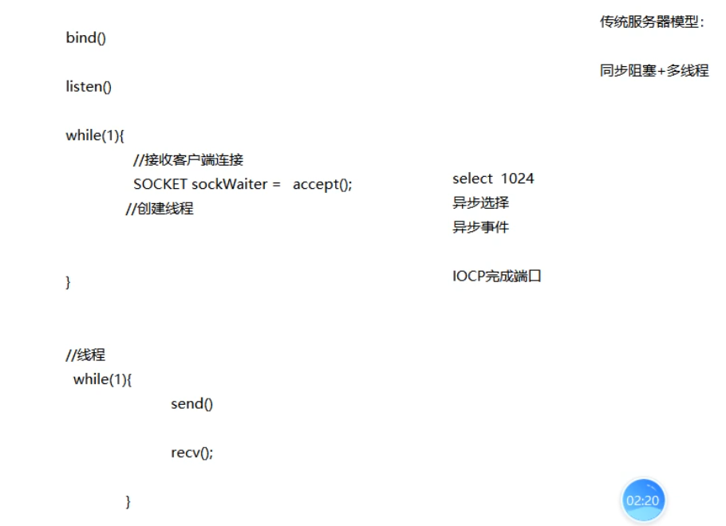
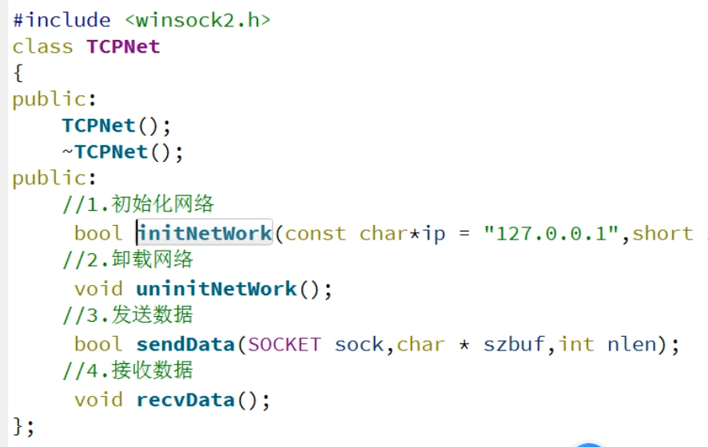
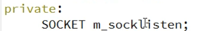
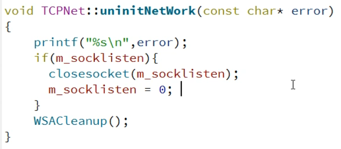

## 服务器封装

## 封装逻辑



## 封装模块



### 初始化网络

1. 在创建套接字的时候发现创建的套接字在其他函数也用到，所以需要设置为**类成员**

   

2. 发现失败时重复卸载，这个任务应该交给卸载函数干

## 卸载网络



剩下的步骤参考客户端封装

服务器端两个SOCKET逻辑，一个是监听需要排队，另外一个是多线程；

两个线程：不仅客户连接是多线程，接收信息也是多线程

`pthis->m_mapThreadIdToSocket[dwThreadId] = sockWaiter;`: 这一行代码将一个名为`sockWaiter`的SOCKET对象赋值给了`m_mapThreadIdToSocket`容器中的一个元素。这个元素的索引是`dwThreadId`，通常是一个线程ID或标识符。
`SOCKET sockWaiter = m_mapThreadIdToSocket[dwThreadId];`: 这一行代码将`m_mapThreadIdToSocket`容器中索引为`dwThreadId`的元素的值（也就是之前赋值的`sockWaiter`对象）复制给了一个名为`sockWaiter`的新变量。
总体来说，这两行代码是用于将一个SOCKET对象与特定线程ID相关联，并在需要时通过线程ID来获取对应的SOCKET对象。

# 客户端封装

## 连接服务器

```c++
bool TCPNet::connectServer(const char *ip, short sport)
{
       WORD wVersionRequested;
       WSADATA wsaData;
      int err;
      wVersionRequested = MAKEWORD(2, 2);

      err = WSAStartup(wVersionRequested, &wsaData);
      if (err != 0) {

          printf("WSAStartup failed with error: %d\n", err);
          return false;
      }


      if (LOBYTE(wsaData.wVersion) != 2 || HIBYTE(wsaData.wVersion) != 2) {

          disconnectServer("WSAStartup err");
          return false;
      }
      else
          printf("The Winsock 2.2 dll was found okay\n");

    //2.创建socket();
      m_sockclient = socket(AF_INET,SOCK_STREAM,0);
      if(INVALID_SOCKET == m_sockclient){
          disconnectServer("socket err");
          return false;
      }
    //3.链接服务器 connect(); -- ip ,port
      sockaddr_in addr;
      addr.sin_family = AF_INET;
      addr.sin_addr.S_un.S_addr = inet_addr(ip);//ip地址
      addr.sin_port = htons(sport);//端口号
      if(SOCKET_ERROR == connect(m_sockclient,(const sockaddr *)&addr,sizeof(addr))){
          disconnectServer("connect err");
          return false;
      }
    //未完待续
```