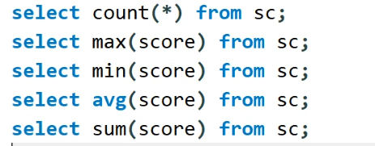

# 数据库基本操作

## 基本规则

1. 第一范式：属性不可拆分

2. 第二范式：不允许对组合主键的部份依赖

   ​	存在大量数据冗余

3. 第三范式： 不允许传递依赖

   1. 对于1对n的关系，将1作为成员插入n所在表中

   

## 基本操作


*如果在修改性别是女的时候报错，可以在Edit-Preferences-SQL editor-最后框子不要勾选；；Query-Reconnect to Server*

## 细致操作

*不等于<>* 


**模糊查询**


*第二种情况是我只知道第二个字是雷*

**聚合函数**

 

1. count(*)和具体某一列的区别

2. 同时查询男女生的数量

   1. 连接-uinon列的个数相同属性尽量类型相同

   

   2. 分组

   

   *前面最好是于分组相关的或者是聚合函数*

   

   

**嵌套查询**


**同时显示多个表的内容**

学生表后面增加每个人的01成绩


学生表后面增加每个人的01，02成绩


学生表后面增加每个人的01>02成绩


*把查询结果作为表，先查表再查条件最后查列*

*SELECT 作为列、表*

### 关联

内联


左联


右联


应用：

通过关联实现查找01成绩高于02成绩的学生的相关信息


### 视图


视图用于简化代码，一般用于查询

# QT&MySQL

`SQL`数据类型并不兼容`QT`，将所有表项都用`string`进行存储，为查询返回结果存储到链表里面，打印的时候赋值给`string`类型并`popfront`，最后`qdebug`的时候注意不能打印`string`类型但可以打印`const string`，用string里面的`c_str`

```c++
#include <QCoreApplication>
#include "CMySql.h"
#include<QDebug>


int main(int argc, char *argv[])
{
    QCoreApplication a(argc, argv);
    CMySql mysql;
    if(mysql.ConnectMySql("localhost","hitwzq","123456","0713test")){
          qDebug()<<"connect success"    ;
    }

//    if(mysql.UpdateMySql("delete from student where sunm="08";")){
//         qDebug()<<"connect success"    ;
//    }
    if(mysql.UpdateMySql("delete from student where snum=08;")){
          qDebug()<<"delete success"    ;
    }

    list<string> lststr;
    mysql.SelectMySql("select sname,sage from student",2,lststr);
    while (lststr.size()>0) {
        string sname=lststr.front();
        lststr.pop_front();
        string sage=lststr.front();
        lststr.pop_front();
        qDebug()<<sname.c_str()<<":"<<sage.c_str();    }


     return a.exec();
}

```