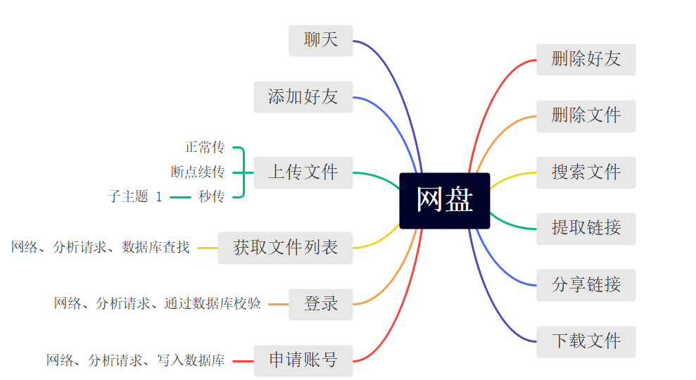
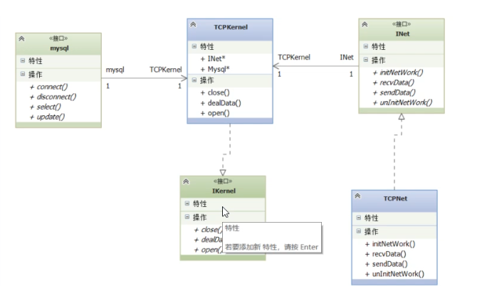
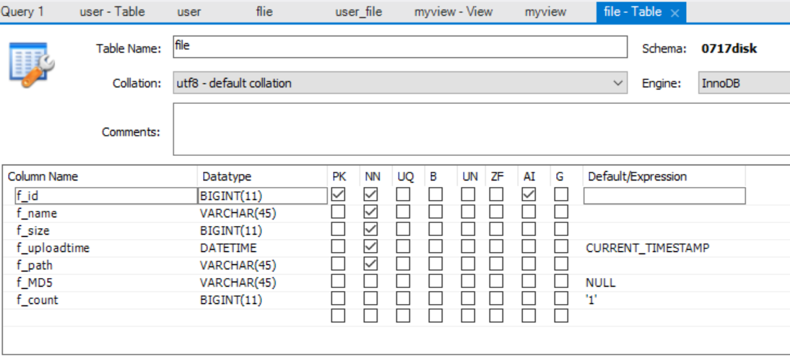
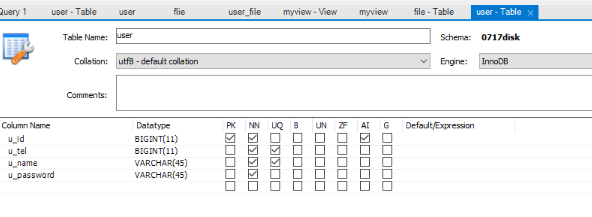
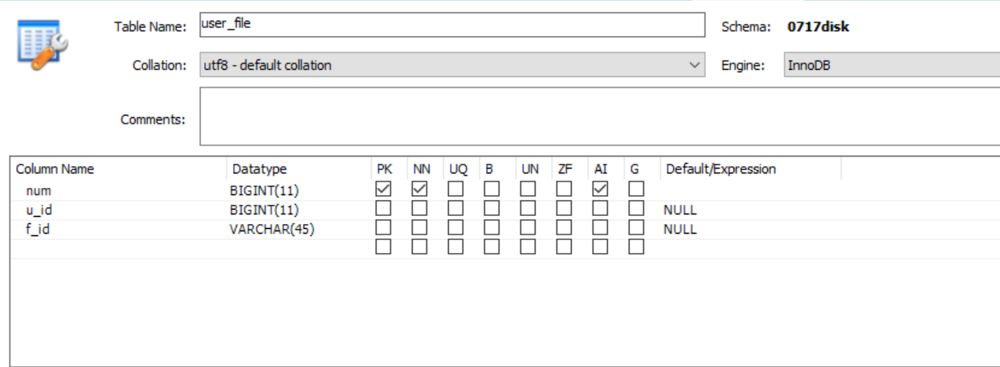
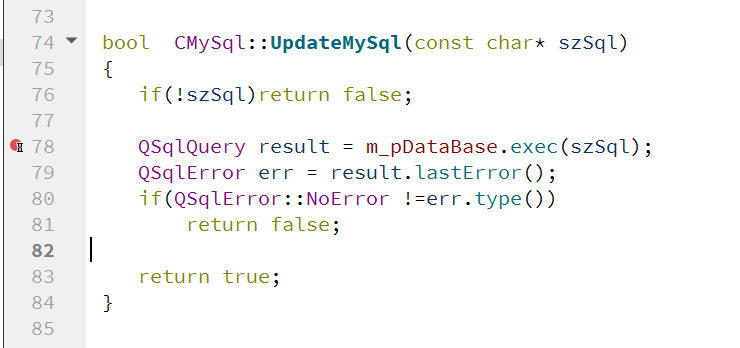

# 网盘

## 功能分析



1. 申请账号
2. 登录
3. 获取文件列表（第一层）
4. 上传文件（正常传，断点续传，秒传）
5. 下载文件
6. 分享链接
7. 提取链接
8. 搜索文件
9. 删除文件 
10. 添加好友/删除好友

商量协议确定需求是什么

## 接口



1. 同生共死是关联关系
2. C++是面向接口编程
3. 核心类只能有一个对象，单例

## 服务器设计

### INet头文件：

```c++
//1.初始化网络
     virtual bool initNetWork(const char* ip = "127.0.0.1",short sport=8899)=0;
    //2.卸载网络
    virtual void uninitNetWork(const char* error)=0;

    //3.发送数据
     virtual bool sendData(SOCKET sock,const char* szbuf,int nlen)=0;
    //4.接收数据
     virtual void recvData()=0;
```

1. **什么叫虚函数**：不需要实现在子类中实现
2. **什么叫虚析构**：防止内存泄露，既调用父类析构，有调用子类析构


### IKernal设计

```c++
#ifndef IKERNAL_H
#define IKERNAL_H
#include "INet.h"

class IKernal{
    
public:
    IKernal(){
        
    };
    virtual ~IKernal(){
        
    };
    
public:
    virtual bool open()=0;
    virtual void close()=0;
    virtual void dealData(SOCKET socket,char* szbuf)=0;
};

#endif // IKERNAL_H

```

 子类结合继承父类的时候，成员变量不能定义对象，只能定义指针

### TCPKernal

1. 错误：:-1: error: No rule to make target 'inet.cpp', needed by 'release/inet.o'.  Stop.
   1. 解决：在pro里删除源文件即可，也不知道是什么时候加进去的估计是删除文件但是没有删除源造成的

1. 继承的时候表明`public`

2. 为保证TCPKernal对象唯一，

   * 把构造和析构私有化，这样就不能再外界构造对象，为全局访问添加访问函数，把这个对象定义成静态私有私有成员。静态对象必须在类外初始化，并且表明类型和作用域

   * 为什么要设计成全局变量

     将单例对象设计为全局变量的做法通常是为了确保在应用程序的生命周期内只有一个实例存在，从而避免创建多个实例造成的资源浪费和不一致性。

```c++
#ifndef TCPKERNAL_H
#define TCPKERNAL_H

#include "IKernal.h"
#include "CMySql.h"
#include <QDebug>
class TCPkernal:public IKernal
{
private:
    TCPkernal();
    ~TCPkernal();
public:
    bool open();
     void close();
    void dealData(SOCKET socket,char* szbuf);
    static TCPkernal* getKernal(){
        return m_kernal;
    };
private:
    INet *m_pTCPnet;
    CMySql *m_sql;
    static TCPkernal* m_kernal;
};

#endif // TCPKERNAL_H

```

### 设计协议

#### 协议

1. 协议设计可能涉及分工所以需要默认从哪里开始
2. 上传文件需要分成上传文件信息和上传文件块两部分

```c++
//协议
#define _default_protocol_base  10
//申请账号
#define _deafult_protocol_regesiter_rq  _default_protocol_base+1
#define _deafult_protocol_regesiter_rs  _default_protocol_base+2
//登录
#define _deafult_protocol_login_rq  _default_protocol_base+3
#define _deafult_protocol_login_rs  _default_protocol_base+4
//获取文件列表
#define _deafult_protocol_getfilelist_rq  _default_protocol_base+5
#define _deafult_protocol_getfilelist_rs  _default_protocol_base+6
//上传文件
#define _deafult_protocol_uploadfilefo_rq  _default_protocol_base+7
#define _deafult_protocol_uploadfilefo_rs  _default_protocol_base+8
//上传文件块
#define _deafult_protocol_uploadfileblock_rq  _default_protocol_base+9
#define _deafult_protocol_uploadfileblock_rs  _default_protocol_base+10

```

#### 协议包

1. 网络传输必须是连续空间不能是链表

```c++
//协议包
#define MAXNUM 45
#define FILENUM 15
struct STRU_REGISTER_RQ{
    char m_ntype;
    long long m_tel;
    char m_szname[MAXNUM];
    char m_szPassword[MAXNUM];
};
struct STRU_REGISTER_RS{
    char m_ntype;
    char m_szResult;
};
struct STRU_LOGIN_RQ{
    char m_ntype;
    char m_szname[MAXNUM];
    char m_szPassword[MAXNUM];
};
struct STRU_LOGIN_RS{
    char m_ntype;
    char m_szResult;
    long long m_userid;
};
//获取文件列表
struct STRU_GETFILELIST_RQ{
    char m_ntype;
    long long m_userid;
};
struct FileInfo{
    char m_szFilseName[MAXNUM];
    long long m_filesize;
    char m_szFileUploadTime[MAXNUM];
};
struct STRU_GETFILELIST_RS{
    char m_ntype;
    FileInfo m_aryFileInfo[FILENUM];
    int m_nFileNum;
};

```

#### 设计数据库表格







#### 处理数据

1. 网络收到数据之后就要将数据就交给Kernal去处理，原来只是简单地打印

2. 错误

   1. 插入返回值是true但是表中不显示，而且查询结果返回true但是list链表没有项

      1. 看一下在哪里弹出了错误窗口
      2. 是在下图这一步出了错

      

      3. 决定返回数据库那里的工程文件测试一下
         1. 看起来好像是分号的问题--排除不是
         2. 原工程代码是没问题的
         3. 查找CSDN原因是没有关联链,是query类没有与数据库连接进行关联的原因。
      4. open返回值的问题
         1. 我终于知道我的错误在哪里了，在于建立网络成功后直接返回了true，根本没连数据库