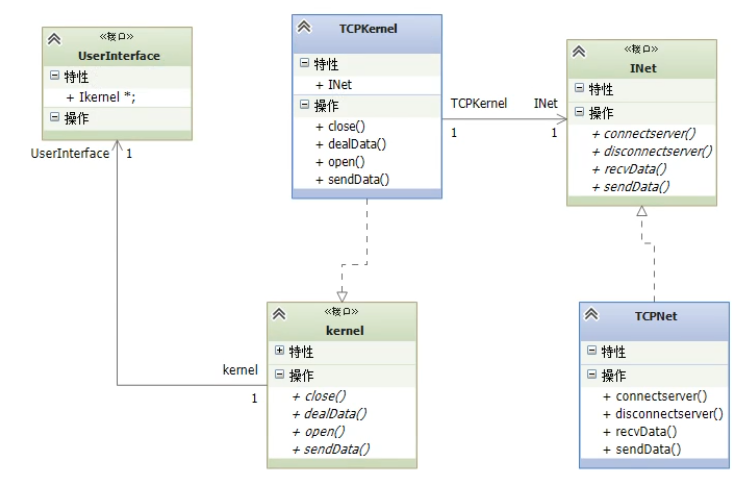
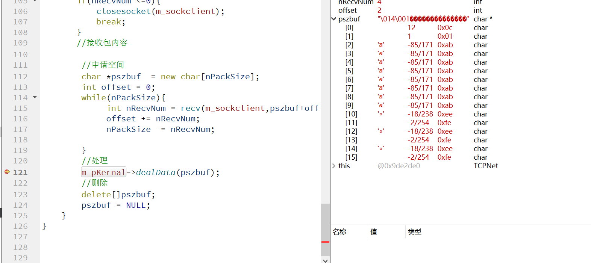
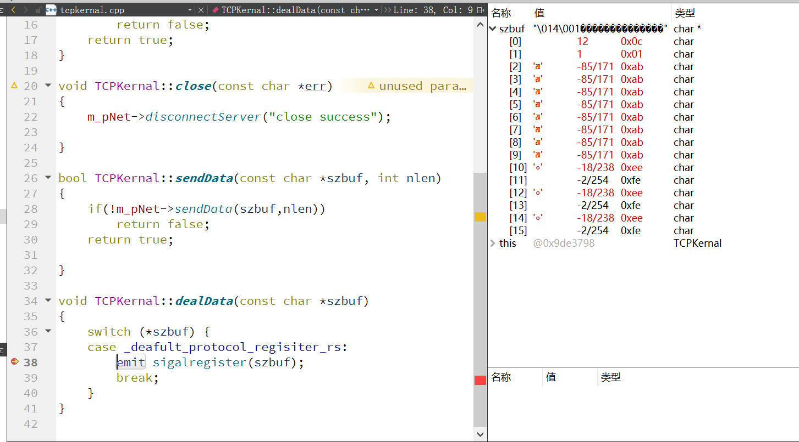

# 客户端设计

## 接口设计



问题1：

注册不成功但表格里面显示是对的，查看一下收到的包的szbuf的内容



传过来的数据是没问题的



收到的数据也是没问题的

```
  m_pKernal->dealData(pszbuf);
```

```
void TCPKernal::dealData(const char* szbuf)
{
    switch (*szbuf) {
    case _deafult_protocol_regisiter_rs:
        emit sigalregister(szbuf);
        break;
    }
}
```

```
void login::slotregister(const char* szbuf)
{
    STRU_REGISTER_RS *psrr=(STRU_REGISTER_RS*)szbuf;
    const char *pszResult="_register_er";
    if(psrr->m_szResult==_register_success)
        pszResult="_register_success";

    QMessageBox::information(this,"register",pszResult);
}
```

```
signals:
    void sigalregister(const char* szbuf);
```

为什么 emit sigalregister(szbuf);之后szbuf就变成了一堆乱码呢

问题是发生在emit发送那里，问题是szbuf不是个常量吗emit只是传递个参数为什么szbuf会从第一个字节是12第二个字节是1变成第一个字节是112

因为我没把delete注释掉。。。。问题是后续在哪里释放