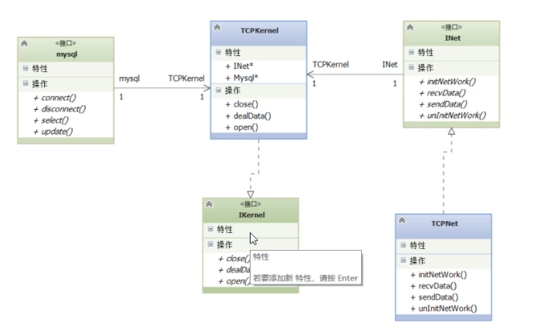

# 功能总结

## 服务器

最主要的就是两部分，网络和数据库的操作

再增加一个核心操作类用于去操作网络和数据库

### 网络类



#### 初始化网络

1. 加载库

   标准函数搜索`WSADATA`官网使用文档里面有相关的函数，关于是否加载成功库）

2. 创建套接字

   `<winsock2.h>`里的关键字类型`socket`

   创建函数`socket(AF_INET,SOCK STREAM,O)`使用`IPV4`还是`IPV6` 什么协议`TCP`还是`UDP ` 最后0是代表不用，默认协议了`SOCKET socket(int af, int type, int protocol)`

3. 绑定地址信息

   `bind`函数将ip地址，端口号与监听套接字绑定在一起

4. 接受客户端连接

   在初始化网络接受客户链接的时候新开线程，线程链表，线程处理函数主要是接受连接并未每一个创建套接字，并且为每一个客人新创建线程新的线程函数调用接收数据

#### 卸载网络

主要是线程的问题，先非强制性地等待线程退出，否则强制杀死线程

##### 关于线程

见`0805.md`

#### 接收数据

```
//接收包大小
//接收包内容
//申请空间

```

1. 线程处理函数主要是在哪里用到的

   在初始化网络接受客户链接的时候新开线程

#### 发送数据

`send`是头文件`winsock`自带的

### 数据库类

主要代码是在`CMysql.h`和 `CMysql.cpp`里面

牵引知识参照`myCloudDisk\0806\0714\note`

数据库的封装

#### 连接

主要实现是通过database里的关键字`QSqlDatabase::addDatabase`

设置好连接名字`host` ` port`1 `user ` `passwrd`之后open

```c++
#include <QSqlDatabase>
#include <QSqlQuery>
#include <QVariant>
#include <QSqlError>
```

#### 断开连接

#### 查询

`mysql_query()` 用于向` MySQL` 发送并执行 `SQL` 语句

```c++
QSqlQuery result = m_pDataBase.exec(szSql);
```

#### 更新

还是`exec`


### 核心类

头文件的设计因为都要求是接口，所以这三个都设计成纯接口类头文件，也就是说不包含任何成员变量，成员函数全都是虚函数

#### `open`

#### `close`

#### `dealdata`

互相发送给胡数据设计头文件规定数据格式是什么样子的，这样在处理数据的时候就能根据第一个字节去判断是什么包类型case 实行不同函数

##### 注册

注册请求数据包包括电话用户名和密码

当服务器收到客户端发来的注册请求的时候，就会解析这个包，获得用户名和密码

```c++
STRU_REGISTER_RQ *psrr=(STRU_REGISTER_RQ*)szbuf;
```

并把它插入到数据库当中

```c++
sprintf(szsql,"insert into user(u_tel,u_name,u_password) values(%lld,'%s','%s')"
            ,psrr->m_tel,psrr->m_szname,psrr->m_szPassword);
```

*在kernel核心类里面都是通过`sprint f`将。数据库指令化成字节流。*

之后会分配空间:

分配空间首先要通过查询获取当前我们分配的用户ID

```c++
if(lststr.size()>0){
            srr.m_szResult=_register_success;
            string strUserId=lststr.front();
            lststr.pop_front();
            //D:/work/myCloudDisk/disk/id
            sprintf(szPath,"%s/%s",m_szSystemPath,strUserId.c_str());
            //创建目录
            CreateDirectoryA(szPath,0);
        }
```

服务器对于每个客户端发来的请求都会回复

##### 登录

服务器收到客户端的登录请求之后，首先会将字节流强行转换成登录请求的格式，从而获得他的用户名和密码。

```
STRU_LOGIN_RQ *pslr=(STRU_LOGIN_RQ*)szbuf;
```

在获得用户名和密码之后，我们首先会查询他用户是否存在，就是通过`select user user name`，然后同时返回UID和u密码。

```c++
sprintf(szsql,"select u_id,u_password from user where u_name='%s';"
            ,pslr->m_szname);
    m_sql->SelectMySql(szsql,2,lststr);
```

确认用户存在之后，就要去确定他的密码是否正确。

```c++
if(lststr.size()>0){

        slr.m_szResult=_login_passwd_err;

        string strUserId =lststr.front();
        lststr.pop_front();
        string strPassword =lststr.front();
        lststr.pop_front();
        //校验密码
       if(0==strcmp(pslr->m_szPassword,strPassword.c_str())){
           //密码正确
           slr.m_szResult=_login_success;
           slr.m_userid=_atoi64(strUserId.c_str());
       }
    }
```

##### 获取文件列表

获取文件列表请求的这个数据包。设计的是只需要知道他的用户名。

```c++
STRU_GETFILELIST_RQ *psgr=(STRU_GETFILELIST_RQ*)szbuf;
```

知道用户名之后，就是去查询，从`my view`这个视图里面查询得到它的文件名和文件大小，还有文件上传时间。

```
sprintf(szsql,"select f_name,f_size,f_uploadtime from myview where u_id=%lld;"
            ,psgr->m_userid);
    m_sql->SelectMySql(szsql,3,lststr);
    int i=0;
```

我们把回复请求设计成里面包括了一个文件信息的结构体，最后打包发送就可以。

在发送的时候，比如说一个页面它最多只有15条，所以说在发送的时候，我们就要设计一个临时变量i，去判断它是否达到15，或者说在没达到15之前，列表的大小就已经变成了零

`m_nFileNum`是指这一个页面包括的是多少条文件数据。

```
while(lststr.size()>0){
        string strFilename=lststr.front();
        lststr.pop_front();
        string strFileSize=lststr.front();
        lststr.pop_front();
        string strFileUpLoadTime=lststr.front();
        lststr.pop_front();

        strcpy(sgr.m_aryFileInfo[i].m_szFilseName,strFilename.c_str());
        sgr.m_aryFileInfo[i].m_filesize=_atoi64(strFileSize.c_str());
        strcpy(sgr.m_aryFileInfo[i].m_szFileUploadTime,strFileUpLoadTime.c_str());

        i++;

        if(i==FILENUM || lststr.size()==0){
            //打包发送
            sgr.m_nFileNum=i;
            m_pTCPnet->sendData(socket,(char*)&sgr,sizeof (sgr));
            i=0;
            ZeroMemory(sgr.m_aryFileInfo,sizeof (sgr.m_aryFileInfo));

        }
    }
```

##### 上传文件

```c++
struct STRU_UPLOADFILEINFO_RQ{
    char m_ntype;
    long long m_userid;
    char m_szFilseName[MAXNUM];
    long long m_filesize;
    char m_szFileMD5[MAXNUM];

};
struct STRU_UPLOADFILEINFO_RS{
    char m_ntype;
    char m_szFileMD5[MAXNUM];
    char m_szResult;
    long long m_szFileId;

};
```

对于服务器收到客户端的上传文件请求之后，首先会从数据包当中获取想要上传的I用户ID和文件MD5值，还有文件的名字，文件的大小

```c++
STRU_UPLOADFILEINFO_RQ  *psur=(STRU_UPLOADFILEINFO_RQ*)szbuf;
sprintf(szsql,"select u_id,f_id,f_count from myview where f_MD5='%s';"
            ,psur->m_szFileMD5);
    m_sql->SelectMySql(szsql,3,lststr);
```

如果说存在的话，那么我们就跟说要进行两步，一个是文件引用计数加一，另外一个是更新用户文件映射表，

对于文件引用计数加一的话，需要用到MD5值。

```c++
//文件引用计数++
        sprintf(szsql,"update file set f_count=f_count+1 where f_MD5='%s';"
                ,psur->m_szFileMD5);
        m_sql->UpdateMySql(szsql);
```

对于对于插入的话需要uid和fid，

```c++
sprintf(szsql,"select u_id,f_id,f_count from myview where f_MD5='%s';"
            ,psur->m_szFileMD5);
    m_sql->SelectMySql(szsql,3,lststr);
    sprintf(szsql,"insert into user_file (u_id,f_id) values(%lld,%lld);;"
                ,psur->m_userid,fileid);
        m_sql->UpdateMySql(szsql);
```

如果说不存在的话，那么这个时候首先要在文件表中插入新文件,需要的是` fid`自动生成，`name ` `size`和`MD5`都是上传得到的

```c++
char szPath[MAX_PATH];
        sprintf(szPath,"%s/%lld/%s",m_szSystemPath,psur->m_userid,psur->m_szFilseName);
        sprintf(szsql,"insert into file (f_name,f_size,f_path,f_MD5) values('%s',%lld,'%s','%s');"
                ,psur->m_szFilseName,psur->m_filesize,szPath,psur->m_szFileMD5);
m_sql->UpdateMySql(szsql);
```

还需要将在映射表当中插入fid和uid的对应关系。

fid需要查询获得

```c++
 list<string> lststr;
        sprintf(szsql,"select f_id from file where f_MD5='%s';"
                ,psur->m_szFileMD5);
        m_sql->SelectMySql(szsql,1,lststr);
```

插入

```c++
if(lststr.size()>0){

            string strFileID=lststr.front();
            lststr.pop_front();
            fileid=_atoi64(strFileID.c_str());
            sur.m_szFileId=fileid;
            sprintf(szsql,"insert into user_file (u_id,f_id) values(%lld,%lld);;"
                    ,psur->m_userid,fileid);
            m_sql->UpdateMySql(szsql);
        }

```

##### 上传文件信息块

```c++
struct STRU_UPLOADFILEINCONTENT_RQ{
    char m_ntype;
    long long m_szFileId;
    long long m_userid;
    char m_szFileContent[FILECONTENT];
    int m_szFileNum;

};

```

上传文件块，服务器在收到请求之后，首先要知道往哪里去写内容，所以这个时候我们需要在`TCPkernal`这个头文件里面去增加一个结构体，保存文件指针以及上传文件的其他信息，比如说`f ID ` `user ID `     `fname`。

~~~c++
struct stru_uploadfileinfo{
    long long m_fileId;
    long long m_userId;
    long long m_filesize;//文件大小
    long long m_filepos;
    FILE* m_pfile; //文件指针
};
~~~

当我们服务器收到之后，就是说先因为它是一个链表去存储的文件信息，所以说我们先需要去遍历找到对应的节点，通过通过`UZID`和`fid`都相等的时候。

```c++
STRU_UPLOADFILEINCONTENT_RQ *psur=(STRU_UPLOADFILEINCONTENT_RQ*)szbuf;
    stru_uploadfileinfo* pInfo=NULL;
    auto ite=m_lstUpLoadFileInfo.begin();
    while(ite!=m_lstUpLoadFileInfo.end()){
        if(psur->m_userid==(*ite)->m_userId &&
                psur->m_szFileId==(*ite)->m_fileId){
            pInfo=*ite;
            break;
        }
        ite++;
    }
```

将文件内容写入到文件当中，关键函数是`fwrite`

如果说文件太大，需要分包传送的话，那么我们就需要知道他写入多少字节。数据结构体里面的位置就是去判定是不是已经写完了，写完了最后就关闭，并写释放几点。

```c++
size_t writenum=fwrite(psur->m_szFileContent,sizeof(char),
           psur->m_szFileNum,
           pInfo->m_pfile);
if(writenum>0){
        pInfo->m_filepos+=writenum;
        if(pInfo->m_filepos==pInfo->m_filesize){
            //文件传输完毕
            fclose(pInfo->m_pfile);
            delete pInfo;
            m_lstUpLoadFileInfo.erase(ite);
        }
    }
```

****

## 客户端类

对于客户端，客户端只需要操作窗口和网络。

同时为了使得代码结构更清晰，我们增加了一个纯接口类头文件，去进行窗口和网络之间的一个协调。


### 核心类

而对于客户端而言，它的TCP kernal里面dealData其实内容不多，只是一个Switch ，然后不同的case里面去发送不同的信号，这样就能上不同的窗口做出反应。

```c++
 switch (*szbuf) {
    case _deafult_protocol_regisiter_rs:
        emit sigalregister(szbuf);
        break;
    case _deafult_protocol_login_rs:
        emit signallogin(szbuf);
        break;
    case _deafult_protocol_getfilelist_rs:
        emit signalgetfilelist(szbuf);
        break;
    case _deafult_protocol_uploadfilefo_rs:
        emit signaluploadfileinfo(szbuf);
        break;
    }
```

```c++
connect((TCPKernal*)m_pKernal,&TCPKernal::sigalregister,
            m_plogin,&login::slotregister);
    connect((TCPKernal*)m_pKernal,&TCPKernal::signallogin,
            this,&Widget::slotlogin);
    connect((TCPKernal*)m_pKernal,&TCPKernal::signalgetfilelist,
            this,&Widget::slotgetfilelist);
    connect((TCPKernal*)m_pKernal,&TCPKernal::signaluploadfileinfo,
            this,&Widget::slotuploadfileinfo);
```

### 窗口类

窗口分两个，一个是弹出注册/登录界面的，另外一个是登录之后转到主窗口显示我们的文件列表以及各种操作按钮。

#### `login.cpp`

##### 申请账号

就是通过获取在控件上输入的字符串，然后把它转成`Q string`类型，再把它打包成指定格式的数据包发送过去就好。

```c++
void login::on_pushButton_clicked()
{
    //申请账号
    QString strTel=ui->registerTel->text();
    QString strUser=ui->registerUser->text();
    QString strPasswrd=ui->registerPasswrd->text();
    qDebug()<<strTel<<strUser<<strPasswrd;


    STRU_REGISTER_RQ srr;
    srr.m_ntype=_deafult_protocol_regisiter_rq;
    srr.m_tel=strTel.toLongLong();
    strcpy(srr.m_szname,strUser.toStdString().c_str());
    strcpy(srr.m_szPassword,strPasswrd.toStdString().c_str());

    m_pKernal->sendData((char*)&srr,sizeof(srr));

}
```

```
case _deafult_protocol_regisiter_rs:
        emit sigalregister(szbuf);
        break;
        connect((TCPKernal*)m_pKernal,&TCPKernal::sigalregister,
            m_plogin,&login::slotregister);
```

收到服务器的回复之后，根据结果弹出提示注册结果。

```c++
void login::slotregister(const char* szbuf)
{
    STRU_REGISTER_RS *psrr=(STRU_REGISTER_RS*)szbuf;
    const char *pszResult="_register_er";
    if(psrr->m_szResult==_register_success)
        pszResult="_register_success";

    QMessageBox::information(this,"register",pszResult);
}
```

##### 登录请求

###### 如何发送

```c++
void login::on_pushButton_2_clicked()
{
    QString strUser=ui->loignUser->text();
    QString strPasswrd=ui->loginPasswrd->text();

    STRU_LOGIN_RQ slr;
    slr.m_ntype=_deafult_protocol_login_rq;
    strcpy(slr.m_szname,strUser.toStdString().c_str());
    strcpy(slr.m_szPassword,strPasswrd.toStdString().c_str());

    m_pKernal->sendData((char*)&slr,sizeof(slr));
}
```

###### 收到登陆回复

```c++
 connect((TCPKernal*)m_pKernal,&TCPKernal::signallogin,
            this,&Widget::slotlogin);
```

#### `widget.cpp`

##### 登陆回复槽函数

收到登录回复之后，通过槽函数跳转到slot login。

不管登录结果是什么样子的，我们都需要去弹出提示登录结果。

```c++
STRU_LOGIN_RS *pslr=(STRU_LOGIN_RS*)szbuf;
    pslr->m_ntype=_deafult_protocol_login_rs;
    const char *pszResult=NULL;
    if(pslr->m_szResult==_login_usernotexist)
        pszResult="_login_usernotexist";
    else if(pslr->m_szResult==_login_passwd_err)
        pszResult="_login_passwd_err";
        else{...}

QMessageBox::information(this,"login",pszResult);
```

如果说登录结果成功的话，那我们就要在把当前注册登录页面进行隐藏，并在主窗口上去显示文件列表。所以这个时候我们需要在回复登录请求的槽函数里面进行发送文请求文件列表的信息。

##### 收到获取文件列表回复槽函数

```c++
struct STRU_GETFILELIST_RS{
    char m_ntype;
    int m_nFileNum;
    FileInfo m_aryFileInfo[FILENUM];

};
```

客户端在收到回复之后，首先接收的是文件类型和文件的数量

```c++
 STRU_GETFILELIST_RS *psgr=(STRU_GETFILELIST_RS*)szbuf;
    psgr->m_ntype=_deafult_protocol_getfilelist_rs;
    m_nFileNum=psgr->m_nFileNum;
```

最后再循环去接收文件的名字、大小和上传时间，并且显示在控件上。

其中文件列表的控件关键词是`table widget`，要想显示名字的话，就是`setItem`。

`Set item`的参数列表，第一个参数代表的是第几行，第二个参数代表的是第几列,第三个参数代表的是我们需要传入的对象，它的类型是`QTableWidgetItem`

```c++
for(i=0;i<psgr->m_nFileNum;i++ ){

        //名字
         QTableWidgetItem *pItem=new QTableWidgetItem(psgr->m_aryFileInfo[i].m_szFilseName);
         ui->tableWidget->setItem(i,0,pItem);
         //大小
         QString pstr=QString::number(psgr->m_aryFileInfo[i].m_filesize);
         pItem=new QTableWidgetItem(pstr);
         ui->tableWidget->setItem(i,1,pItem);
         //上传时间
         pItem=new QTableWidgetItem(psgr->m_aryFileInfo[i].m_szFileUploadTime);
         ui->tableWidget->setItem(i,2,pItem);


    }
```

##### 上传文件请求

上传文件的时候，我们首先知道的是文件路径；获取文件名字，我们通过section去节选，第一个参数代表的是节选至哪个字符，-1代表的是从右往左。

```c++
 QString pathName = QFileDialog::getOpenFileName(this, tr("Open File"),
                                                      ".",
                                                      tr("Images (*.png *.xpm *.jpg);;Text files (*.txt);;ALL files (*.*)"));
    qDebug()<<pathName;
    //获取文件名字
    QString fileName=pathName.section('/',-1);
    
```

获取文件大小关键字类型是首先要打开文件，关键函数`size`，最后关闭文件

~~~c++
//获取文件大小
    QFile file(pathName);
    file.open(QIODevice::ReadOnly);
    qint64 size=file.size();
    file.close();
~~~

打包成数据包

```c++
STRU_UPLOADFILEINFO_RQ sur;
    sur.m_ntype=_deafult_protocol_uploadfilefo_rq;
    sur.m_userid=m_userid;
    sur.m_filesize=size;
    strcpy(sur.m_szFileMD5,strMD5.c_str());
    strcpy(sur.m_szFilseName,fileName.toStdString().c_str());
    m_pKernal->sendData((char*)&sur,sizeof(sur));
```

这里有一个问题是不能通过文件信息知道`userid`，但这个时候其实我们已经登录了，所以说我们把u子ID设置成这个`widget`类的一个成员变量。因为我们登录回复的里面就包括了`user ID`，然后在登录回复的槽函数里面，将成员变量赋值。

```c++
//把文件信息保存下来到链表
    stru_uploadfileinfo* pInfo=new stru_uploadfileinfo;
    pInfo->m_pfile=fopen(pathName.toStdString().c_str(),"rb+");
    pInfo->m_fileId=0;
    pInfo->m_filesize=size;
    strcpy(pInfo->m_szFilseName,fileName.toStdString().c_str());
    strcpy(pInfo->m_szFileMD5,strMD5.c_str());

    m_lstUpLoadFileInfo.push_back(pInfo);
```

##### 收到上传文件信息回复槽函数

收到回复之后，我们首先迭代得到文件位置

```c++
stru_uploadfileinfo* pInfo=NULL;
    auto ite=m_lstUpLoadFileInfo.begin();
    while(ite!=m_lstUpLoadFileInfo.end()){
        if(0==strcmp(psur->m_szFileMD5,(*ite)->m_szFileMD5)){
            pInfo=*ite;
            break;
        }
        ite++;
    }
```

然后如果是秒传的话，正常应该是将这些文件信息显示到控件上，但是由于正常上传也需要控件，所以我们把它放到if else的模块外面

```c++
if(psur->m_szResult==_uploadfileinfo_success){

    }
    else{...}
//名字
     QTableWidgetItem *pItem=new QTableWidgetItem(pInfo->m_szFilseName);
     ui->tableWidget->setItem(m_nFileNum,0,pItem);
     //大小
     QString pstr=QString::number(pInfo->m_filesize);
     pItem=new QTableWidgetItem(pstr);
     ui->tableWidget->setItem(m_nFileNum,1,pItem);
     //上传时间
     QDateTime date=QDateTime::currentDateTime();
     QTime t=QTime::currentTime();
     QString strDate=date.toString();
     QString strTime=t.toString();
     pItem=new QTableWidgetItem(strDate+" "+strTime);
     ui->tableWidget->setItem(m_nFileNum,2,pItem);
     m_nFileNum++;
        QMessageBox::information(this,"upload file","_uploadfileinfo_success");

        delete pInfo;
        m_lstUpLoadFileInfo.erase(ite);
```

如果说是正常上传的话，那么关键函数就是open，然后因为可能文件太大，需要分次发送，所以我们去`size_t readnum`去获得上传的文件的真实大小。

```c++
STRU_UPLOADFILEINCONTENT_RQ sur;
        sur.m_ntype=_deafult_protocol_uploadfileblock_rq;
        sur.m_userid=m_userid;
        sur.m_szFileId=psur->m_szFileId;
        while(1){
            size_t readnum=fread(sur.m_szFileContent,
                                 sizeof(char),
                                 sizeof(sur.m_szFileContent),
                                 pInfo->m_pfile
                        );
            if(readnum>0){
                sur.m_szFileNum=readnum;
                m_pKernal->sendData((char*)&sur,sizeof (sur));
            }
            else
                break;
        }
        fclose(pInfo->m_pfile);
```

open什么时候用


文件指针与文件大小